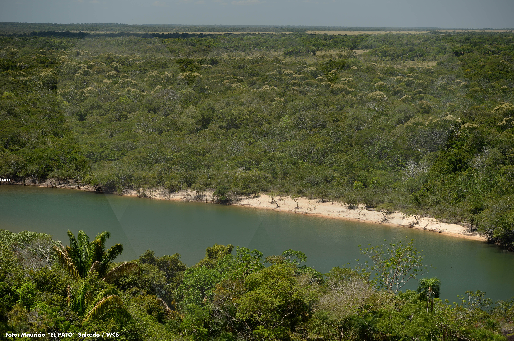
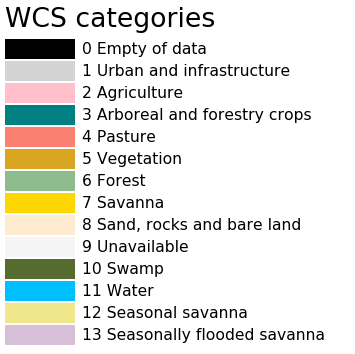
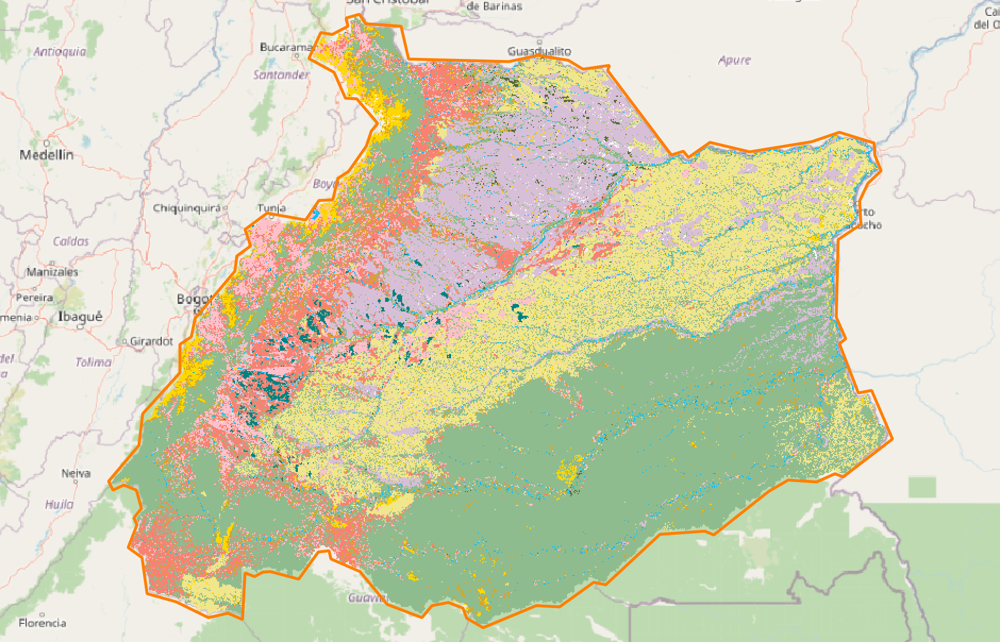
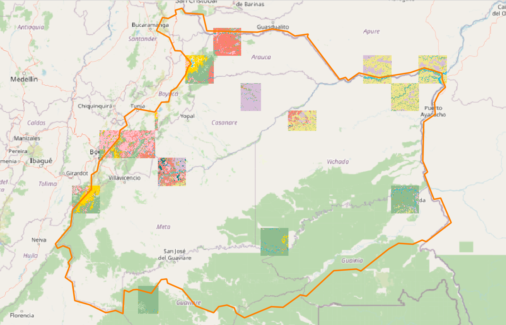
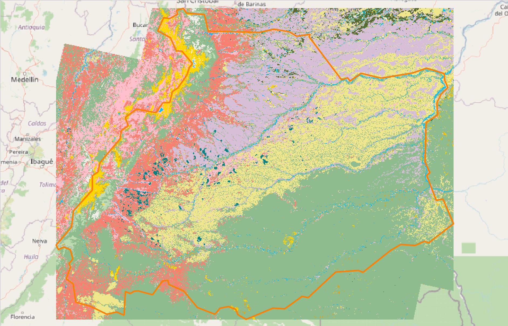

# Land cover mapping the Orinoquía region 

In this [AI for Earth](https://www.microsoft.com/en-us/ai/ai-for-earth) project, we worked with the Wildlife Conservation Society Colombia ([WCS Colombia](https://colombia.wcs.org/en-us)) to create up-to-date land cover maps of the [Orinoquía](https://colombia.wcs.org/en-us/Wild-Places/Orinoquia.aspx) region in Colombia. This natural region encompasses a high diversity of ecosystems, from seasonally flooded savanna to rainforest. In recent years, agricultural production has expanded, causing changes in these ecosystems. It is therefore critically important to present information on land use to policy makers so that they may balance the need for agricultural development and conserving the biodiversity and ecological functions of the region.


Landscape near Sabanas, Colombia. Photo credit Wildlife Conservation Society. 

Specifically, we used a land use and land cover (LULC) map that was manually produced using satellite imagery and field data from 2011-2012 to train a semantic segmentation model for 12 land cover classes. The model can be applied to composites of Landsat 8 imagery collected in subsequent years to enable ecological analysis. 

This repo contains the scripts and configuration files used to train the land cover model using a median composite of Landsat 8 images from 2013-2014. We will be evaluating the result of applying the model to 2019-2020 imagery and releasing the resulting maps in the coming months. 

Category color map:




Labels based on imagery in 2011-2012, mapped to the 12 land cover classes:


Model predictions on validation tiles from the 2013-2014 median composite of Landsat 8 imagery:


Model prediction on 2019-2020/04 median composite, the updated land cover map:



## Installation

At the root directory of this repo, use `environment.yml` to create a conda virtual environment called `wcs`:

```bash
conda env create --file environment.yml
```

If you need additional packages, add them in `environment.yml` and update the environment:

```bash
conda env update --name wcs --file environment.yml --prune
```

### `ai4eutils`

You need to add the [`ai4eutils`](https://github.com/microsoft/ai4eutils) repo to the `PYTHONPATH`, as we make use of the `geospatial` module there.


### Setting up the Solaris package

We need to set up a separate conda environment for using Solaris. Instructions are available on https://github.com/CosmiQ/solaris.

We do not want to install the Solaris pip package inside the `wcs` environment because it requires versions of PyTorch/TensorFlow that we might not want. 

There are two ways to set up Solaris:

1. To install Solaris using their published package on PyPI, first create a conda environment called `solaris`, which will make the next pip installation step go smoothly:
    ```
    conda create --file environment_solaris.yml
    pip install solaris==0.2.2
    ```

2. If installing from source:

    Once we clone the repo, add some more dependencies to its `environment.yml` so that Jupyter Notebook ran from our `wcs` environment can use the Solaris kernel to run certain notebooks:
    ```
      - nb_conda_kernels
      - ipykernel
      - humanfriendly
    ```

Our fork of Solaris is here: https://github.com/yangsiyu007/solaris

Upstream: https://github.com/CosmiQ/solaris


### Setting up an environment for the newer version of GDAL

It seems that in our existing environment, `rasterio` is not compatible with `GDAL>=3.1`, which is required for creating Cloud Optimized GeoTIFFs (COGs). We create a separate environment for GDAL to run such commands in:
 
```bash
conda create --name gdalnew --channel conda-forge python gdal==3.1.2
```


## Terminology

See [Satellite data terminology](https://github.com/microsoft/ai4eutils/tree/master/geospatial#satellite-data-terminology).


## Related repositories

The interactive Land Cover Mapping tool; also see [finetuning](./finetuning).

https://github.com/microsoft/landcover

Collection of utilities used in this repo:

https://github.com/microsoft/ai4eutils


## Contributing

This project welcomes contributions and suggestions.  Most contributions require you to agree to a
Contributor License Agreement (CLA) declaring that you have the right to, and actually do, grant us
the rights to use your contribution. For details, visit https://cla.opensource.microsoft.com.

When you submit a pull request, a CLA bot will automatically determine whether you need to provide
a CLA and decorate the PR appropriately (e.g., status check, comment). Simply follow the instructions
provided by the bot. You will only need to do this once across all repos using our CLA.

This project has adopted the [Microsoft Open Source Code of Conduct](https://opensource.microsoft.com/codeofconduct/).
For more information see the [Code of Conduct FAQ](https://opensource.microsoft.com/codeofconduct/faq/) or
contact [opencode@microsoft.com](mailto:opencode@microsoft.com) with any additional questions or comments.


## License
This repository is licensed with the MIT license. See [LICENSE](./LICENSE).
